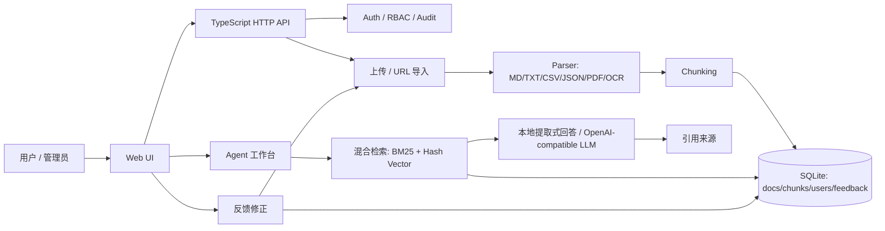

# SEKA — Self-Evolving Knowledge Agent

SEKA 是一个 **TypeScript 全栈**的本地个人 / 企业知识库 Agent MVP。它支持文档上传、解析、切块、混合检索、带引用问答、用户反馈与知识迭代，目标是把分散资料沉淀成可追溯、可更新、可验证的知识系统。


## Java 后端独立版本

本仓库额外提供一个独立的 **Spring Boot 3 + Java 21 + JPA + H2** 后端实现，位于：

```text
java-backend/
```

它复刻核心知识库 Agent 能力：登录会话、admin/editor/viewer RBAC、workspace 授权、审计日志、文档上传切块、检索问答、反馈闭环和 Markdown 报告导出。适合作为简历中的 Java 企业后端版本展示。

启动：

```powershell
cd java-backend
mvn spring-boot:run
```

默认地址：`http://127.0.0.1:8865`，默认账号：`admin / admin123`。

## 当前实现

- **后端**：Node.js + TypeScript + 原生 HTTP Server。
- **数据库**：Node 内置 `node:sqlite` + SQLite 本地文件。
- **前端**：HTML / CSS / TypeScript，服务端按需将浏览器端 TS 转为 JS。
- **解析**：Markdown、TXT、JSON、CSV、PDF、图片 OCR。
- **检索**：BM25 风格关键词检索 + 哈希向量语义近似检索。
- **问答**：默认本地提取式回答；可配置 OpenAI-compatible API。
- **迭代**：用户反馈、错误记录、保存问答为新知识并重新索引。
- **知识空间**：文档支持 workspace、tags、description，适合区分个人 / 公司 / 项目资料。
- **网页接入**：支持 URL 抓取、正文提取并自动纳入知识库。
- **Agent 工作台**：支持任务意图识别、工具调用记录、知识库问答、对比、缺口分析和网页导入编排。
- **权限与审计**：内置登录、admin/editor/viewer 三类角色、Bearer Token 会话和审计日志。
- **用户管理**：前端支持 admin 查看用户、创建用户、分配角色、启用 / 禁用账号、配置 workspace 授权。
- **空间级访问控制**：非 admin 用户可限制到指定 workspace，只能查看、统计、检索、问答、导出授权空间。
- **反馈修正闭环**：错误反馈可进入工作台、标记已修正，并可保存为修正知识重新入库。
- **知识检索**：支持直接检索原始 chunks 和来源片段，不必每次调用 LLM。
- **运营仪表盘**：前端展示文档数、chunk 数、空间数、反馈状态、QA 量、审计量和本地存储容量。
- **文档详情**：支持查看单个文档的元数据、解析提示、摘要和 chunk 预览，方便展示“可解释索引”。
- **文档维护**：文档详情页可直接编辑 title、workspace、tags、description，并写入审计日志。
- **报告导出**：支持按 workspace 导出 Markdown 知识库报告，便于复盘、分享和项目展示。
- **安全设置**：当前用户可修改密码；运行设置面板展示 LLM/OCR/上传限制/数据目录和默认密码风险提示。
- **部署交付**：提供 Dockerfile 与 docker-compose，可一条命令启动本地演示环境。
- **自动验证**：提供 smoke test、HTTP API integration test 与 GitHub Actions CI，覆盖核心业务与端到端接口链路。

> 说明：当前版本使用 Node 24 的原生 TypeScript strip 能力和实验性 `node:sqlite`，无需构建即可运行。

## 项目结构

```text
SEKA/
├─ .env.example            # 环境变量示例
├─ .github/workflows/
│  └─ ci.yml               # GitHub Actions 验证
├─ docs/
│  ├─ DEMO.md              # 面试 / 录屏演示步骤
│  ├─ API_EXAMPLES.md      # API 调用示例
│  ├─ JAVA_BACKEND_DEMO.md # Java 后端单独演示脚本
│  ├─ COMPLETION_AUDIT.md  # 目标完成度与交付审计
│  └─ RESUME.md            # 简历 bullet 与面试话术
├─ src/
│  ├─ shared/
│  │  └─ types.ts          # 前后端共享类型
│  └─ server/
│     ├─ server.ts         # HTTP API + 静态资源服务
│     ├─ core.ts           # 知识库业务编排
│     ├─ db.ts             # SQLite 数据访问
│     ├─ auth.ts           # 登录、会话、RBAC、审计日志
│     ├─ agent.ts          # Agent 任务编排与工具调用记录
│     ├─ parsers.ts        # Markdown/PDF/OCR 等解析
│     ├─ chunking.ts       # 文档切块
│     ├─ retrieval.ts      # 混合检索
│     ├─ llm.ts            # LLM / 本地回答生成
│     ├─ web-source.ts     # URL 抓取与正文提取
│     └─ config.ts         # 配置
├─ web/
│  ├─ index.html
│  ├─ styles.css
│  └─ app.ts               # 浏览器端 TypeScript
├─ scripts/
│  ├─ smoke-test.ts       # 核心业务烟雾测试
│  ├─ api-test.ts         # 真实 HTTP API 集成测试
│  └─ seed-demo.ts        # 演示数据初始化
├─ package.json
└─ tsconfig.json
```

## 快速启动

```powershell
npm install
npm run dev
```

然后打开：

```text
http://127.0.0.1:8765
```

默认开发账号：

```text
用户名：admin
密码：admin123
```

正式使用建议通过环境变量覆盖：

```powershell
$env:SEKA_ADMIN_USERNAME="admin"
$env:SEKA_ADMIN_PASSWORD="更安全的密码"
```

也可以复制 `.env.example` 作为配置参考。

## 演示与 API 示例

- [Demo Walkthrough](docs/DEMO.md)：适合面试、录屏和项目展示。
- [API Examples](docs/API_EXAMPLES.md)：包含登录、上传、搜索、问答、Agent、反馈、用户授权和报告导出示例。
- [Java Backend Demo](docs/JAVA_BACKEND_DEMO.md)：单独展示 Spring Boot Java 后端、权限隔离、反馈闭环和报告导出。
- [Completion Audit](docs/COMPLETION_AUDIT.md)：对照最初目标检查已完成能力、证据和 MVP 边界。
- [Resume Guide](docs/RESUME.md)：可直接复制到简历的项目描述、bullet 和面试讲解话术。

## 填充演示数据

首次演示前可运行：

```powershell
npm run seed
```

它会写入三份示例知识文档，覆盖 `resume`、`company`、`product` 三个知识空间，并输出一次 Agent 总结结果。适合录屏、截图或面试现场快速展示。

## Docker 一键部署

```powershell
docker compose up --build
```

访问：

```text
http://127.0.0.1:8765
```

`docker-compose.yml` 默认把数据持久化到 `seka-data` volume，并把服务绑定到容器内 `0.0.0.0:8765`。正式演示前请把 `SEKA_ADMIN_PASSWORD` 改成强密码。

## 验证

```powershell
npm run typecheck
npm run smoke
npm run test:api
```

也可以一次跑完整验证：

```powershell
npm test
```

烟雾测试会验证：

```text
上传文档 → 元数据入库 → 解析切块 → 空间内检索问答 → 返回引用 → 保存反馈为新知识
```

HTTP API 集成测试会启动临时服务并验证：

```text
登录 → multipart 上传 → 文档详情/chunks → 元数据更新 → 搜索/问答 → 统计/设置 → 报告导出 → 创建 viewer → workspace 授权 → 权限拒绝 → 用户禁用/启用 → 改密
```

## API 概览

| 方法 | 路径 | 说明 |
|---|---|---|
| GET | `/api/health` | 健康检查 |
| POST | `/api/auth/login` | 登录并获取 token |
| GET | `/api/auth/me` | 获取当前用户 |
| POST | `/api/auth/logout` | 退出登录 |
| POST | `/api/auth/change-password` | 当前用户修改密码 |
| GET | `/api/users` | 用户列表，admin |
| POST | `/api/users` | 创建用户，admin |
| POST | `/api/users/{id}/status` | 启用 / 禁用用户，admin |
| POST | `/api/users/{id}/workspaces` | 配置用户可访问 workspace，admin |
| GET | `/api/audit-logs` | 审计日志，admin |
| GET | `/api/documents` | 文档列表 |
| POST | `/api/documents` | 上传文档，字段名 `file` |
| POST | `/api/documents/{id}/metadata` | 更新文档 title/workspace/tags/description |
| GET | `/api/workspaces` | 知识空间统计 |
| GET | `/api/stats` | 知识库概览统计 |
| GET | `/api/settings` | 运行配置与安全提示 |
| GET | `/api/export/markdown` | 导出 Markdown 知识库报告，可传 `workspace` |
| POST | `/api/sources/url` | 抓取网页并纳入知识库 |
| GET | `/api/documents/{id}` | 文档详情 |
| GET | `/api/documents/{id}/chunks` | 文档切块 |
| DELETE | `/api/documents/{id}` | 删除文档 |
| POST | `/api/documents/{id}/reindex` | 重新解析并索引 |
| POST | `/api/search` | 直接检索知识片段 |
| POST | `/api/query` | 知识库问答 |
| POST | `/api/agent/run` | 运行 Agent 任务 |
| POST | `/api/feedback` | 提交反馈 / 保存为知识 |
| POST | `/api/feedback/{id}/resolve` | 修正反馈并可保存为知识 |
| GET | `/api/feedback` | 反馈列表 |

## LLM 配置

默认使用本地提取式回答，不需要 API Key。

如需接入 OpenAI-compatible API：

```powershell
$env:OPENAI_API_KEY="你的 API Key"
$env:SEKA_LLM_BASE_URL="https://api.openai.com/v1"
$env:SEKA_LLM_MODEL="gpt-4o-mini"
npm run dev
```

也可以接入 Ollama / LM Studio / DeepSeek 等兼容 `/chat/completions` 的服务。

## OCR 说明

项目已安装 `tesseract.js`。默认 OCR 语言为 `eng`，可通过环境变量配置：

```powershell
$env:SEKA_OCR_LANG="eng"
```

如果需要中文 OCR，可进一步配置 tesseract.js 语言数据或改接 PaddleOCR。

## 简历项目表达

> 设计并实现 TypeScript 全栈本地知识库 Agent 系统，支持多格式文档解析、SQLite 知识存储、混合检索、RAG 问答、答案溯源和反馈迭代机制，解决企业内部知识分散、检索困难和 AI 回答不可验证的问题。

可拆成简历 bullet：

- 用 TypeScript 实现本地知识库 Agent：覆盖文档上传、解析切块、混合检索、RAG 问答、引用溯源与反馈再入库闭环。
- 设计 SQLite 数据模型，支持 workspace/tags 元数据、QA 历史、反馈修正、RBAC 用户体系和审计日志。
- 实现 workspace 级访问控制，使非 admin 用户只能访问被授权的知识空间。
- 实现 Agent 工作台，自动识别问答、对比、缺口分析、总结、网页导入等任务，并记录工具调用链路。
- 构建无框架前端仪表盘，展示知识库统计、运行设置、文档详情、chunk 预览、检索结果、引用来源和反馈处理状态。
- 支持文档元数据维护，允许用户在前端调整知识空间、标签和说明以优化后续检索。
- 提供 Docker Compose 一键部署、用户改密和默认密码风险提示，提升项目工程化与安全完整度。
- 编写 smoke/API 自动化测试与 CI，验证解析入库、检索问答、反馈迭代、RBAC 权限、workspace 授权、用户禁用、报告导出和改密等关键链路。

## 架构流程



## 下一步 Roadmap

- 引入 Qdrant / Chroma 替换当前哈希向量检索。
- 引入 React / Next.js 做前端工程化升级。
- 增加 Git 仓库解析、飞书 / Notion 接入。
- 增加 reranker、评测集、召回率 / 准确率报表。
- 增加更多数据源连接器、批量导入和导出 HTML/PDF 报告。

